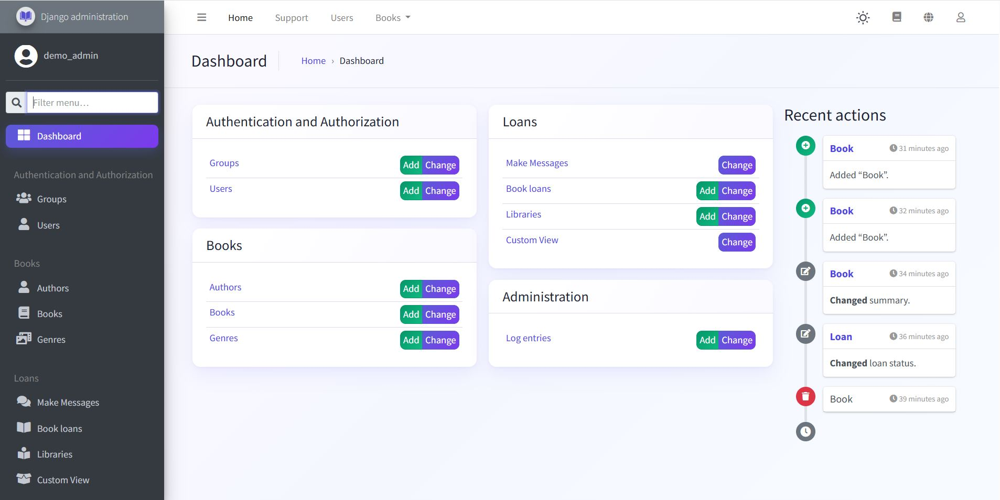
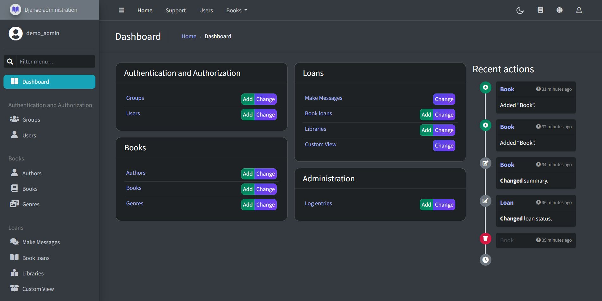

# Django Richmin

### A polished, configurable admin experience for Django

Django Richmin is a drop-in theme for Django's admin that turns the default interface into a modern, responsive workspace. It combines AdminLTE 3, Bootstrap 4, and Font Awesome 5 with practical admin features such as light and dark modes, configurable navigation, multiple form layouts, global filters, related-object modals, and Persian Jalali date support.

Richmin keeps Django's familiar `ModelAdmin` workflow intact: install the app before `django.contrib.admin`, then customize as much or as little as your project needs.

<table>
  <tr>
    <th>Light mode</th>
    <th>Dark mode</th>
  </tr>
  <tr>
    <td></td>
    <td></td>
  </tr>
</table>

## Highlights

- Drop-in styling with no required configuration
- Responsive left-to-right and right-to-left layouts
- Default and legacy themes, each with Auto, Light, and Dark modes
- Configurable branding, login screen, favicon, and user avatar
- Custom top, side, and user menus with permission-aware links
- Admin-wide search across one or more models
- Navbar filters that can filter multiple model admins globally
- Five change-form layouts with per-model overrides
- Bootstrap modal for related-object add/change/delete views
- Live UI builder plus custom CSS and JavaScript hooks
- Select2 inputs, sticky actions, and Ctrl+S form saving
- Language chooser and Persian Jalali date widgets
- Template support for django-import-export, django-filer, django-mptt, and django-solo

## Requirements

- Python 3.6 or newer
- Django 4.x or 5.x (`django>4,<6`)

## Installation

```shell
pip install django-richmin
```

Add `richmin` **before** `django.contrib.admin` so its templates take precedence:

```python
INSTALLED_APPS = [
    'richmin',
    'django.contrib.admin',
    # ...
]
```

No URL changes or custom admin site are required. Start the development server and open your existing `/admin/` URL.

## Quick start

Richmin works immediately with its defaults. Add `RICHMIN_SETTINGS` to your project's `settings.py` when you are ready to brand the admin and select its main behavior:

```python
RICHMIN_SETTINGS = {
    'site_title': 'Acme Admin',
    'site_header': 'Acme',
    'site_brand': 'Acme',
    'welcome_sign': 'Welcome to Acme',
    'copyright': 'Acme Ltd.',
    'search_model': ['auth.User', 'auth.Group'],
    'theme': 'default',
    'changeform_format': 'horizontal_tabs',
}
```

All settings are optional. Static asset paths in the examples are relative to Django's configured static-file finders.

## Configuration

### Branding and general behavior

Configure Richmin with a `RICHMIN_SETTINGS` dictionary in `settings.py`.

| Setting | Default | Purpose |
| --- | --- | --- |
| `theme` | `'default'` | Theme family: `'default'` or `'legacy'` |
| `site_title` | Admin site title | Browser-window title |
| `site_header` | Admin site header | Login-screen heading |
| `site_brand` | Admin site header | Sidebar brand text |
| `site_logo` | AdminLTE logo | Static path to the sidebar logo |
| `login_logo` | `site_logo` | Static path to the login logo |
| `login_logo_dark` | `login_logo` | Login logo used in dark mode |
| `site_logo_classes` | `'img-circle'` | CSS classes applied to the site logo |
| `site_icon` | `site_logo` | Static path to the favicon |
| `welcome_sign` | `'Welcome'` | Login-screen welcome text |
| `copyright` | `''` | Footer copyright text |
| `user_avatar` | `None` | User model field name or callable returning an image URL |
| `language_chooser` | `True` | Show the language selector |
| `enable_ctrl_s_save` | `True` | Save change forms with Ctrl+S |
| `custom_css` | `None` | Static path to an additional stylesheet |
| `custom_js` | `None` | Static path to an additional script |
| `use_google_fonts_cdn` | `True` | Load the default font from Google Fonts |
| `show_ui_builder` | `False` | Show the live UI customization panel |

Example with project assets:

```python
RICHMIN_SETTINGS = {
    'site_logo': 'admin/img/logo.png',
    'login_logo': 'admin/img/login-logo.png',
    'login_logo_dark': 'admin/img/login-logo-dark.png',
    'site_icon': 'admin/img/favicon.png',
    'site_logo_classes': 'img-circle elevation-3',
    'custom_css': 'admin/css/custom.css',
    'custom_js': 'admin/js/custom.js',
}
```

### Themes and color modes

The modern `default` theme is enabled automatically. Use `legacy` to restore Richmin's original appearance:

```python
RICHMIN_SETTINGS = {
    'theme': 'legacy',
}
```

Both theme families provide independent light and dark stylesheets. Users can switch between Auto, Light, and Dark modes from the admin interface; Auto follows the operating-system preference.

### Search

Set `search_model` to one model label or a list of model labels. Richmin sends each query to that model admin's standard search, so configure `search_fields` on the corresponding `ModelAdmin` as usual.

```python
RICHMIN_SETTINGS = {
    'search_model': ['catalog.Book', 'auth.User'],
}

# admin.py
@admin.register(Book)
class BookAdmin(admin.ModelAdmin):
    search_fields = ('title', 'isbn')
```

### Navigation menus

Richmin can control all three admin navigation areas:

```python
RICHMIN_SETTINGS = {
    'topmenu_links': [
        {'name': 'Dashboard', 'url': 'admin:index'},
        {'name': 'Users', 'model': 'auth.User'},
        {'app': 'catalog'},
        {
            'name': 'Documentation',
            'url': 'https://example.com/docs/',
            'new_window': True,
        },
    ],
    'usermenu_links': [
        {'name': 'My profile', 'model': 'auth.User'},
    ],
    'custom_links': {
        'catalog': [
            {
                'name': 'Reports',
                'url': 'catalog-reports',
                'icon': 'fas fa-chart-bar',
                'permissions': ['catalog.view_book'],
            },
        ],
    },
}
```

Link dictionaries support named Django URLs, external URLs, model links, app dropdowns, `new_window`, and permission lists. An app link is supported in `topmenu_links`, but not in `usermenu_links`.

Side-menu settings:

| Setting | Default | Purpose |
| --- | --- | --- |
| `show_sidebar` | `True` | Show or hide the side navigation |
| `navigation_expanded` | `True` | Start with navigation groups expanded |
| `hide_apps` | `[]` | App labels to omit |
| `hide_models` | `[]` | `app_label.model_name` entries to omit |
| `order_with_respect_to` | `[]` | Preferred order for apps, models, and custom links |
| `custom_links` | `{}` | Extra links grouped under an installed app |
| `icons` | Auth defaults | Font Awesome classes for apps and models |
| `default_icon_parents` | `'fas fa-chevron-circle-right'` | Default app icon |
| `default_icon_children` | `'fas fa-circle'` | Default model icon |

```python
RICHMIN_SETTINGS = {
    'hide_apps': ['admin'],
    'hide_models': ['auth.group'],
    'order_with_respect_to': ['catalog', 'catalog.book', 'auth'],
    'icons': {
        'catalog': 'fas fa-book-open',
        'catalog.book': 'fas fa-book',
        'auth.user': 'fas fa-user',
    },
}
```

### Change-form layouts

Choose a layout for all admin change forms and override it for individual models:

```python
RICHMIN_SETTINGS = {
    'changeform_format': 'horizontal_tabs',
    'changeform_format_overrides': {
        'auth.user': 'collapsible',
        'catalog.book': 'vertical_tabs',
    },
}
```

Available layouts are:

- `single`
- `horizontal_tabs` (default)
- `vertical_tabs`
- `collapsible`
- `carousel`

Fieldsets and inline formsets become sections in these layouts. Set `richmin_section_order` on a model admin when they need an explicit order:

```python
@admin.register(Book)
class BookAdmin(admin.ModelAdmin):
    richmin_section_order = ('Details', 'Authors', 'Inventory')
```

### Related-object modals

Replace Django's separate related-object popup window with a Bootstrap modal:

```python
RICHMIN_SETTINGS = {
    'related_modal_active': True,
}
```

If your clickjacking policy blocks the modal iframe, allow same-origin framing:

```python
X_FRAME_OPTIONS = 'SAMEORIGIN'
```

### Navbar global filters

Global filters let a selection in the navbar constrain multiple admin change lists. First expose one or more filter models:

```python
RICHMIN_SETTINGS = {
    'filter_model': ['organizations.Organization', 'projects.Project'],
}
```

Then place `GlobalFilterMixin` first in each participating admin class and map the target relation to the filter model name:

```python
from django.contrib import admin
from richmin.admin_mixin import GlobalFilterMixin


@admin.register(Task)
class TaskAdmin(GlobalFilterMixin, admin.ModelAdmin):
    global_filter = [
        ('project__organization', 'organization'),
        ('project', 'project'),
    ]
```

The relation may also end in `_id`. Filtering is applied to change-list querysets and intentionally skipped on change-form pages.

### UI customization

Use `RICHMIN_UI_TWEAKS` for layout and color classes. These values map to AdminLTE and Bootstrap classes:

```python
RICHMIN_UI_TWEAKS = {
    'navbar': 'navbar-dark navbar-primary',
    'brand_colour': 'navbar-primary',
    'accent': 'accent-info',
    'sidebar': 'sidebar-dark-info',
    'navbar_fixed': True,
    'sidebar_fixed': True,
    'actions_sticky_top': True,
    'sidebar_nav_compact_style': True,
    'button_classes': {
        'primary': 'btn-primary',
        'secondary': 'btn-secondary',
        'info': 'btn-info',
        'warning': 'btn-warning',
        'danger': 'btn-danger',
        'success': 'btn-success',
    },
}
```

Available keys:

| Area | Settings |
| --- | --- |
| Typography | `navbar_small_text`, `footer_small_text`, `body_small_text`, `brand_small_text`, `sidebar_nav_small_text` |
| Colors | `brand_colour`, `accent`, `navbar`, `sidebar` |
| Layout | `navbar_fixed`, `footer_fixed`, `sidebar_fixed`, `layout_boxed`, `no_navbar_border` |
| Sidebar | `sidebar_disable_expand`, `sidebar_nav_child_indent`, `sidebar_nav_compact_style`, `sidebar_nav_legacy_style`, `sidebar_nav_flat_style` |
| Controls | `button_classes`, `actions_sticky_top` |

When `layout_boxed` is enabled, fixed navbar and footer behavior is disabled to avoid conflicting layouts. Set `show_ui_builder` to `True` while experimenting; the builder previews and generates these choices.

## Input list filters

Use `InputFilter` when a change-list filter is better represented by a free-text
input than a dropdown. The `parameter_name` can include any valid Django ORM
lookup:

```python
from richmin.filters import InputFilter


class UrlPathFilter(InputFilter):
    title = 'URL path'
    parameter_name = 'url_path'


class ISBNFilter(InputFilter):
    title = 'ISBN'
    parameter_name = 'isbn'


class BookAdmin(RichminAdmin):
    list_filter = (ISBNFilter,)
```

Invalid values are reported through Django's messages framework and return an
empty result set instead of raising an error page.

## Persian and Jalali dates

Date list filters can use the same language-aware behavior with
`DateInputFilter`. It renders Django's standard Gregorian date picker for other
languages and a Jalali picker when Persian is active:

```python
from richmin.filters import DateInputFilter


class PublishedOnFilter(DateInputFilter):
    title = 'Published on'
    parameter_name = 'published_on'


class BookAdmin(RichminAdmin):
    list_filter = (PublishedOnFilter,)
```

When Persian (`fa`) is the active language, `RichminAdmin` automatically uses a Jalali date picker for `DateField` and `DateTimeField` inputs and formats those fields as Jalali dates in change-list tables. Stored database values remain normal Gregorian Django dates.

```python
from django.contrib import admin
from richmin.admin import RichminAdmin


@admin.register(Event)
class EventAdmin(RichminAdmin):
    list_display = ('name', 'starts_at')
```

If an admin already inherits from another base, put `JalaliAdminMixin` first. Jalali-ready stacked and tabular inline classes are included too:

```python
from django.contrib.auth.admin import UserAdmin
from richmin.admin import JalaliAdminMixin, RichminStackedInline, RichminTabularInline


class CustomUserAdmin(JalaliAdminMixin, UserAdmin):
    pass


class EventInline(RichminTabularInline):
    model = Event
```

The Jalali input accepts `YYYY/MM/DD` (including Persian or Arabic digits) and converts it to a Gregorian `date` before saving.

## Ecosystem compatibility

Richmin ships matching admin templates for common Django admin extensions:

- django-import-export import and export views
- django-filer file, image, folder, and breadcrumb views
- django-mptt filters
- django-solo change forms and history
- Django admindocs and authentication/password-management pages

These integrations are optional; install and configure only the packages your project uses.

## Development and releasing

Install the project and development requirements, then run the tests with your normal Django/pytest workflow. To build and publish a release, install the release tools and run the cross-platform release script:

```shell
python -m pip install -r requirements.release.txt
python release.py
```

The script clears generated build artifacts, builds and validates the distributions, and uploads them to PyPI. Existing files are skipped so an interrupted upload can be retried safely.

## Thanks

Django Richmin was initially a fork of [django-jazzmin](https://github.com/farridav/django-jazzmin).

Django Richmin is built with [AdminLTE 3](https://adminlte.io/), [Bootstrap 4](https://getbootstrap.com/), and [Font Awesome 5](https://fontawesome.com/).

## License

Django Richmin is released under the MIT License.
